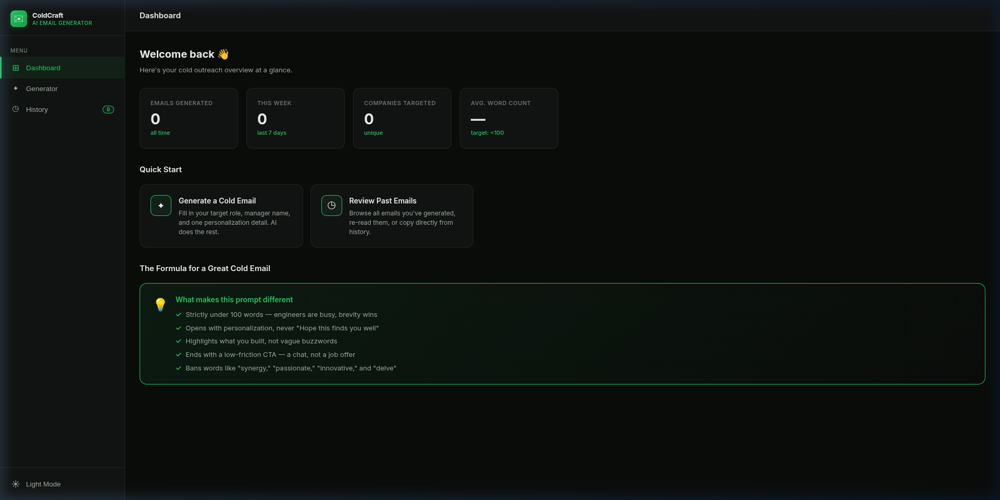

# ColdCraft — AI Cold Email Generator

[](https://opensource.org/licenses/MIT)
[](https://www.python.org/downloads/)
[](https://fastapi.tiangolo.com/)
[](#)
[](https://build.nvidia.com)

ColdCraft is an AI-powered SaaS dashboard built for software developers to generate highly personalized, under-100-word cold emails to hiring managers. It strictly follows best practices for engineering outreach: no fluff, confident tone, and direct highlights of technical contributions.



## Features
- **Strict Banned Words**: Refuses to use generic filler like "synergy," "passionate," or "innovative."
- **GitHub & Website Scraping**: Automatically fetches a user's GitHub portfolio, scrapes their optionally linked personal website, and reads specific repository READMEs to personalize the email.
- **Native Email Client Integration**: Click to send via your computer's native email client (Gmail, Apple Mail, Outlook). No backend SMTP configuration needed!
- **History & Analytics**: Saves generated emails to local storage and provides dashboard metrics.
- **Dark/Light Mode**: Toggleable theme that persists across sessions.
- **Multi-page Layout**: Dashboard, Generator, and History views.

---

## 🚀 Getting Started

ColdCraft uses a lightweight Python backend (`FastAPI`) to securely communicate with the Nvidia API and scrape GitHub/Websites, and a vanilla HTML/JS/CSS frontend.

### Prerequisites
- Python 3.9+
- An API Key for [Nvidia Build (Llama 3.1 70B)](https://build.nvidia.com)

### 1. Clone the repository
```bash
git clone https://github.com/theallmyti/Cold-mail-generator.git
cd Cold-mail-generator
```

### 2. Set up the Python Backend
Create a virtual environment and install the required packages:
```bash
# Create and activate a virtual environment
python -m venv venv
source venv/bin/activate  # On Windows use: venv\Scripts\activate

# Install dependencies
pip install -r requirements.txt
```

### 3. Add your API Key
Open `config.js` in the root directory and add your Nvidia API key:
```javascript
var NVIDIA_API_KEY = "your-api-key-here";
```

### 4. Run the Backend Server
Start the FastAPI server:
```bash
# Ensure your virtual environment is activated
python main.py
```
*The backend will run on `http://127.0.0.1:8000`.*

### 5. Open the Frontend
Since the frontend is built with vanilla web technologies, you can simply open the `index.html` file directly in your browser!

```bash
# On Linux
xdg-open index.html

# On macOS
open index.html

# On Windows
start index.html
```
*(Alternatively, you can use an extension like VS Code Live Server.)*

---

## Tech Stack
- **Frontend**: Vanilla HTML5, CSS3, JavaScript (No frameworks)
- **Backend**: Python, FastAPI, BeautifulSoup4 (for scraping), httpx (for async requests)
- **AI Model**: `meta/llama-3.1-70b-instruct` via Nvidia Build

## License
MIT License
